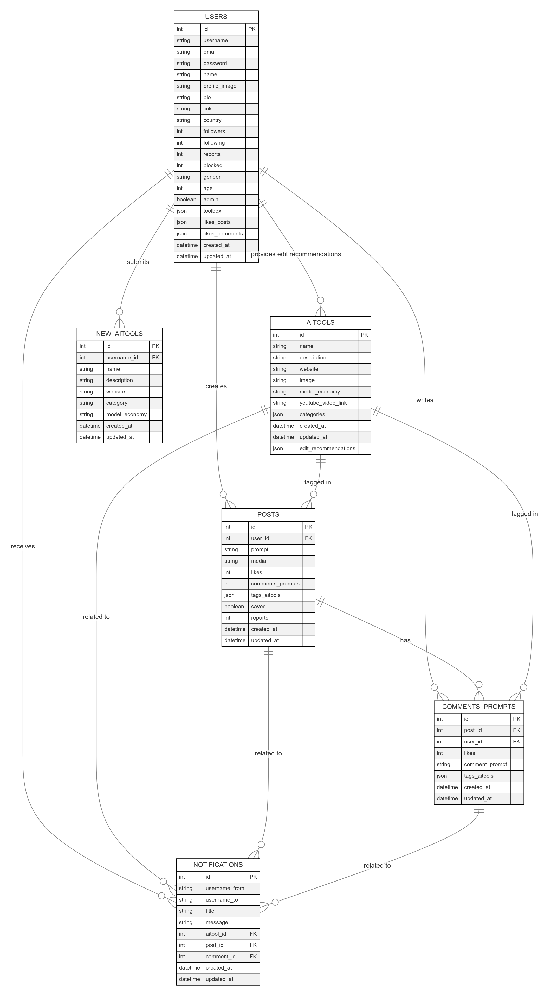

## Índice

0. [Ficha del proyecto](#0-ficha-del-proyecto)
1. [Descripción general del producto](#1-descripción-general-del-producto)
2. [Arquitectura del sistema](#2-arquitectura-del-sistema)
3. [Modelo de datos](#3-modelo-de-datos)
4. [Especificación de la API](#4-especificación-de-la-api)
5. [Historias de usuario](#5-historias-de-usuario)
6. [Tickets de trabajo](#6-tickets-de-trabajo)
7. [Pull requests](#7-pull-requests)

---

## 0. Ficha del proyecto

### Marco Antonio Dominguez

### Relaitool

### AIProfiles social media Platform for Generative AIs Familiarization focussed on the average tech enthusiast user.

### https://github.com/MarcoDominguez/Relaitool

> Puede ser pública o privada, en cuyo caso deberás compartir los accesos de manera segura. Puedes enviarlos a [alvaro@lidr.co](mailto:alvaro@lidr.co) usando algún servicio como [onetimesecret](https://onetimesecret.com/).

### 0.5. URL o archivo comprimido del repositorio

> Puedes tenerlo alojado en público o en privado, en cuyo caso deberás compartir los accesos de manera segura. Puedes enviarlos a [alvaro@lidr.co](mailto:alvaro@lidr.co) usando algún servicio como [onetimesecret](https://onetimesecret.com/). También puedes compartir por correo un archivo zip con el contenido


---

## 1. Descripción general del producto

> Describe en detalle los siguientes aspectos del producto:

### **1.1. Objetivo:**

Development of a centralized social media platform for connection, creation and learningwith the world of Generative AIs, focused on the average technology enthusiast user.

### **1.2. Características y funcionalidades principales:**

1- Connect with other users to share knowledge and experiences (prompts/posts) regarding the use of Generative AIs.
2- Create, edit and delete publications with content created by Generative IAs including the tagg of the tools used, as well as the integration of written format prompts with which the content was developed, whether audio, video or image published on the platform.
3- Create, edit and delete comments on other users' publications in written prompt format.
4- Create, edit and delete user AIprofiles.
5- Search users, posts and their AItools saved in your Toolbox
6. Save or delete AItools in each user's Toolbox.
7- AItools Catalog so that users can learn about the available tools and can use them in their user-generated publications as well as save them in their Toolbox.

### **1.3. Diseño y experiencia de usuario:**

Provide images and/or video tutorial showing the user experience from landing on the application, going through all the main functionalities. Include a step by step.
Add initial functionality to add users and save AItools to your Toolbox initially when creating a new user

### **1.4. Instrucciones de instalación:**
Documenta de manera precisa las instrucciones para instalar y poner en marcha el proyecto en local (librerías, backend, frontend, servidor, base de datos, migraciones y semillas de datos, etc.)

---

## 2. Arquitectura del Sistema

### **2.1. Diagrama de arquitectura:**
1. Main Components

Frontend:
Build front-end with React, Tailwind & Vite. (gptengineer.app)
Description: The user interface of the application, allowing users to interact with the platform, create posts, comment, and manage their profiles.

Backend:
Technology: Node.js with Express.js 
Description: Handles business logic, processes requests from the frontend, interacts with the database, and manages user authentication and authorization.

Database:
Technology: PostgreSQL (or MongoDB for NoSQL)
Description: Stores user data, posts, comments, AI tools, and notifications in a structured format, ensuring data integrity and efficient querying.

API:
Technology: RESTful API (or GraphQL)
Description: Facilitates communication between the frontend and backend, allowing for CRUD operations on resources like users, posts, and comments.
Authentication:
Technology: JWT (JSON Web Tokens) or OAuth
Description: Manages user sessions and secures API endpoints, ensuring that only authorized users can access certain functionalities.
Deployment:
Technology: Docker for containerization, AWS or Heroku for cloud hosting
Description: Ensures that the application can be easily deployed and scaled, providing a reliable environment for users.

2. Architectural Pattern
Microservices Architecture:
The application can be designed using a microservices architecture, where each component (frontend, backend, database) operates as an independent service. This allows for better scalability and maintainability.

3. Justification for Chosen Architecture
Scalability:
The microservices architecture allows individual components to be scaled independently based on demand. For instance, if the number of users increases, the backend services can be scaled without affecting the frontend.
Maintainability:
Each component can be developed, tested, and deployed independently. This separation of concerns makes it easier to manage codebases and implement changes without affecting the entire system.
Flexibility:
Different technologies can be used for different components. For example, the frontend can be built with React.js for a dynamic user experience, while the backend can use Node.js for efficient handling of asynchronous requests.
Improved Performance:
By using a RESTful API, the application can efficiently handle requests and responses, optimizing the user experience. Caching strategies can also be implemented to enhance performance.

4. Benefits
User Experience:
A responsive and interactive frontend enhances user engagement and satisfaction.
Data Integrity:
Using a relational database like PostgreSQL ensures that data is structured and relationships are maintained, reducing the risk of data anomalies.
Security:
Implementing JWT or OAuth for authentication adds a layer of security, protecting user data and ensuring that only authorized users can access sensitive operations.
Deployment Efficiency:
Containerization with Docker simplifies the deployment process, making it easier to manage dependencies and environment configurations.

5. Sacrifices or Deficits
Complexity:
A microservices architecture can introduce complexity in terms of service management, inter-service communication, and deployment strategies.
Overhead:
The need for additional infrastructure to manage multiple services can lead to increased operational costs and resource usage.
Latency:
Communication between microservices can introduce latency, especially if not optimized properly.
Learning Curve:
Developers may need to familiarize themselves with multiple technologies and frameworks, which can slow down initial development.


### **2.2. Descripción de componentes principales:**

## Principal Components

### 1. Frontend
- **Technology Stack**:
  - React.js with Vite (for fast development and optimized builds)
  - Tailwind CSS (for responsive and modern UI design)
  - Redux Toolkit (for state management)
  - React Router (for client-side routing)
  - Axios (for HTTP requests)

- **Key Features**:
  - Webapp for desktop
  - Real-time updates for notifications and comments
  - Client-side form validation
  - Image/media upload functionality
  - Infinite scroll for posts feed
  - Search functionality with filters
  - User profile management
  - AItools catalog browsing

### 2. Backend
- **Technology Stack**:
  - Node.js with Express.js
  - TypeScript (for type safety)
  - Prisma (ORM for database operations)
  - JWT for authentication
  - Multer (for file uploads)
  - Socket.io (for real-time features)

- **Key Features**:
  - RESTful API endpoints
  - Authentication and authorization
  - File upload handling
  - Real-time notifications
  - Rate limiting
  - Error handling middleware
  - Input validation
  - Logging system

### 3. Database
- **Technology Stack**:
  - PostgreSQL (primary database)
  - Redis (for caching and sessions)

- **Key Features**:
  - Relational data structure
  - ACID compliance
  - Complex queries support
  - Full-text search capabilities
  - Data integrity constraints
  - Efficient indexing
  - Backup and recovery systems

### 4. Authentication & Security
- **Technology Stack**:
  - JWT (JSON Web Tokens)
  - bcrypt (for password hashing)
  - CORS middleware
  - Helmet.js (for security headers)

- **Key Features**:
  - Secure user authentication
  - Password encryption
  - Role-based access control
  - Session management
  - XSS protection
  - CSRF protection
  - Rate limiting

### 5. Cloud Services & Deployment
- **Technology Stack**:
  - Docker (containerization)
  - AWS S3 (media storage)
  - AWS EC2 (hosting)
  - GitHub Actions (CI/CD)
  - Nginx (reverse proxy)

- **Key Features**:
  - Containerized applications
  - Automated deployments
  - Scalable infrastructure
  - Load balancing
  - SSL/TLS encryption
  - Media content delivery
  - Automated backups

### 6. Development & Testing
- **Technology Stack**:
  - Jest (unit testing)
  - React Testing Library
  - Cypress (E2E testing)
  - ESLint & Prettier (code formatting)
  - Swagger (API documentation)

- **Key Features**:
  - Automated testing
  - Code quality checks
  - API documentation
  - Development guidelines
  - Version control with Git
  - Code review process

### 7. Monitoring & Analytics
- **Technology Stack**:
  - Sentry (error tracking)
  - Google Analytics
  - Winston (logging)
  - Prometheus & Grafana (metrics)

- **Key Features**:
  - Error tracking and reporting
  - User behavior analytics
  - Performance monitoring
  - System health checks
  - Custom metrics tracking
  - Automated alerts

### **2.3. Descripción de alto nivel del proyecto y estructura de ficheros**

## Project Structure
bash
relaitool/
├── client/ # Frontend application
│ ├── public/ # Static files
│ ├── src/
│ │ ├── assets/ # Images, fonts, etc.
│ │ ├── components/ # Reusable UI components
│ │ │ ├── common/ # Shared components (buttons, inputs, etc.)
│ │ │ ├── layout/ # Layout components (header, footer, etc.)
│ │ │ └── features/ # Feature-specific components
│ │ ├── hooks/ # Custom React hooks
│ │ ├── pages/ # Page components
│ │ ├── services/ # API services
│ │ ├── store/ # Redux store configuration
│ │ ├── styles/ # Global styles and themes
│ │ ├── types/ # TypeScript type definitions
│ │ └── utils/ # Utility functions
│ ├── tests/ # Frontend tests
│ └── package.json
│
├── server/ # Backend application
│ ├── src/
│ │ ├── config/ # Configuration files
│ │ ├── controllers/ # Request handlers
│ │ ├── middleware/ # Custom middleware
│ │ ├── models/ # Database models
│ │ ├── routes/ # API routes
│ │ ├── services/ # Business logic
│ │ ├── types/ # TypeScript type definitions
│ │ └── utils/ # Utility functions
│ ├── tests/ # Backend tests
│ └── package.json
│
├── shared/ # Shared code between frontend and backend
│ ├── constants/ # Shared constants
│ ├── types/ # Shared TypeScript types
│ └── utils/ # Shared utility functions
│
├── docker/ # Docker configuration files
│ ├── development/
│ └── production/
│
├── docs/ # Documentation
│ ├── api/ # API documentation
│ ├── architecture/ # Architecture diagrams
│ └── guides/ # Development guides
│
└── scripts/ # Build and deployment scripts

### **2.4. Infraestructura y despliegue**


### Architecture Patterns

The project follows several architectural patterns and principles:

1. **Clean Architecture**
   - Clear separation of concerns
   - Independence of frameworks
   - Testability
   - Business logic isolation

2. **Feature-First Organization**
   - Components grouped by feature
   - Improved maintainability
   - Better scalability
   - Easier team collaboration

3. **Domain-Driven Design (DDD)**
   - Business logic in services layer
   - Clear domain boundaries
   - Rich domain models

### Key Directories Explained

#### Frontend (`client/`)
- Follows Atomic Design principles
- Component-based architecture
- State management with Redux
- Feature-first organization

#### Backend (`server/`)
- MVC-inspired architecture
- Route -> Controller -> Service -> Model flow
- Middleware-based request processing
- Clear separation of business logic

#### Shared (`shared/`)
- Cross-cutting concerns
- Type definitions
- Constants
- Utility functions

#### Infrastructure (`docker/`)
- Environment-specific configurations
- Container definitions
- Service orchestration

#### Documentation (`docs/`)
- API specifications
- Architecture documentation
- Development guides
- Onboarding materials

### Benefits of This Structure

1. **Scalability**
   - Easy to add new features
   - Independent scaling of components
   - Clear boundaries between services

2. **Maintainability**
   - Clear organization
   - Consistent patterns
   - Easy to understand structure

3. **Development Experience**
   - Clear separation of concerns
   - Easy to find files
   - Consistent conventions

4. **Testing**
   - Isolated components
   - Clear boundaries
   - Easy to mock dependencies

### Development Workflow

1. **Feature Development**
   - Create feature branch
   - Implement in relevant directories
   - Add tests
   - Create pull request

2. **Testing**
   - Unit tests in respective directories
   - Integration tests
   - E2E tests

3. **Deployment**
   - Docker builds
   - CI/CD pipeline
   - Environment-specific configs

### Best Practices

1. **Code Organization**
   - Feature-first approach
   - Clear naming conventions
   - Consistent file structure

2. **Documentation**
   - Inline documentation
   - API documentation
   - Architecture decisions

3. **Testing**
   - Test coverage requirements
   - Integration tests
   - E2E testing

This structure provides a solid foundation for scalable development while maintaining clarity and organization throughout the project's growth.

### **2.5. Seguridad**

# Security Implementation

## 1. Authentication & Authorization

### JWT (JSON Web Tokens)
javascript
// Example of JWT implementation
const jwt = require('jsonwebtoken');
const generateToken = (user) => {
return jwt.sign(
{ id: user.id, email: user.email, role: user.role },
process.env.JWT_SECRET,
{ expiresIn: '24h' }
);
};
const verifyToken = (req, res, next) => {
const token = req.headers['authorization']?.split(' ')[1];
if (!token) return res.status(401).json({ message: 'No token provided' });
try {
const decoded = jwt.verify(token, process.env.JWT_SECRET);
req.user = decoded;
next();
} catch (error) {
return res.status(401).json({ message: 'Invalid token' });
}
};


### Role-Based Access Control (RBAC)
typescript
enum UserRole {
USER = 'user',
ADMIN = 'admin',
MODERATOR = 'moderator'
}
const checkRole = (roles: UserRole[]) => {
return (req: Request, res: Response, next: NextFunction) => {
if (!roles.includes(req.user.role)) {
return res.status(403).json({ message: 'Insufficient permissions' });
}
next();
};
};
// Usage in routes
router.delete('/posts/:id', checkRole([UserRole.ADMIN, UserRole.MODERATOR]), deletePost);


## 2. Data Protection

### Password Hashing
javascript
const bcrypt = require('bcrypt');
const hashPassword = async (password) => {
const salt = await bcrypt.genSalt(10);
return bcrypt.hash(password, salt);
};
const verifyPassword = async (password, hashedPassword) => {
return await bcrypt.compare(password, hashedPassword);
};


### Data Encryption
typescript
// Example of sensitive data encryption
import as crypto from 'crypto';
const algorithm = 'aes-256-cbc';
const key = crypto.randomBytes(32);
const iv = crypto.randomBytes(16);
const encrypt = (text: string): string => {
const cipher = crypto.createCipheriv(algorithm, key, iv);
let encrypted = cipher.update(text, 'utf8', 'hex');
encrypted += cipher.final('hex');
return encrypted;
};
const decrypt = (encrypted: string): string => {
const decipher = crypto.createDecipheriv(algorithm, key, iv);
let decrypted = decipher.update(encrypted, 'hex', 'utf8');
decrypted += decipher.final('utf8');
return decrypted;
};


## 3. Input Validation & Sanitization

### Request Validation
javascript
// Using Express-validator
const { body, validationResult } = require('express-validator');
const validatePost = [
body('title').trim().isLength({ min: 3, max: 100 }),
body('content').trim().isLength({ min: 10 }),
body('tags').isArray(),
(req, res, next) => {
const errors = validationResult(req);
if (!errors.isEmpty()) {
return res.status(400).json({ errors: errors.array() });
}
next();
}
];


### XSS Prevention
typescript
// Using helmet middleware
import helmet from 'helmet';
app.use(helmet());
app.use(helmet.xssFilter());
app.use(helmet.noSniff());


## 4. Rate Limiting
javascript
const rateLimit = require('express-rate-limit');
const apiLimiter = rateLimit({
windowMs: 15 60 1000, // 15 minutes
max: 100, // limit each IP to 100 requests per windowMs
message: 'Too many requests from this IP, please try again later'
});
app.use('/api/', apiLimiter);


## 5. CORS Configuration
javascript
const cors = require('cors');
const corsOptions = {
origin: process.env.ALLOWED_ORIGINS.split(','),
methods: ['GET', 'POST', 'PUT', 'DELETE'],
allowedHeaders: ['Content-Type', 'Authorization'],
credentials: true,
maxAge: 86400 // 24 hours
};
app.use(cors(corsOptions));


## 6. Security Headers
javascript
// Custom security headers middleware
const securityHeaders = (req, res, next) => {
res.setHeader('Strict-Transport-Security', 'max-age=31536000; includeSubDomains');
res.setHeader('X-Content-Type-Options', 'nosniff');
res.setHeader('X-Frame-Options', 'DENY');
res.setHeader('X-XSS-Protection', '1; mode=block');
next();
};
app.use(securityHeaders);


## 7. File Upload Security
javascript
const multer = require('multer');
const upload = multer({
limits: {
fileSize: 5 1024 1024, // 5MB max file size
},
fileFilter: (req, file, cb) => {
const allowedTypes = ['image/jpeg', 'image/png'];
if (!allowedTypes.includes(file.mimetype)) {
cb(new Error('Invalid file type'));
return;
}
cb(null, true);
}
});


## 8. SQL Injection Prevention
typescript
// Using Prisma ORM for safe database queries
import { PrismaClient } from '@prisma/client';
const prisma = new PrismaClient();
// Safe query example
const getUserPosts = async (userId: string) => {
return await prisma.post.findMany({
where: {
userId: userId
},
select: {
id: true,
title: true,
content: true
}
});
};


## 9. Session Management
avascript
const session = require('express-session');
const RedisStore = require('connect-redis')(session);
app.use(session({
store: new RedisStore({ client: redisClient }),
secret: process.env.SESSION_SECRET,
resave: false,
saveUninitialized: false,
cookie: {
secure: process.env.NODE_ENV === 'production',
httpOnly: true,
maxAge: 24 60 60 1000 // 24 hours
}
}));


## 10. Error Handling
typescript
// Global error handler
const errorHandler = (err: Error, req: Request, res: Response, next: NextFunction) => {
console.error(err.stack);
// Don't leak error details in production
const message = process.env.NODE_ENV === 'production'
? 'Internal Server Error'
: err.message;
res.status(500).json({
error: message,
requestId: req.id // for tracking purposes
});
};
app.use(errorHandler);


### **2.6. Tests**

# Testing Strategy

## 1. Unit Testing
- **Description**: Unit tests focus on individual components or functions to ensure they work as intended in isolation.
- **Tools**: Jest for JavaScript/TypeScript testing.
- **Examples**:
  - Testing utility functions (e.g., data formatting, calculations).
  - Verifying the behavior of individual React components (e.g., rendering, state changes).

## 2. Integration Testing
- **Description**: Integration tests check how different modules or services work together. They ensure that the interactions between components are functioning correctly.
- **Tools**: Jest and React Testing Library for frontend; Supertest for API testing.
- **Examples**:
  - Testing API endpoints to ensure they return the expected responses when called with valid and invalid data.
  - Verifying that the frontend correctly interacts with the backend services (e.g., fetching data and displaying it).

## 3. End-to-End (E2E) Testing
- **Description**: E2E tests simulate real user scenarios to validate the entire application flow from start to finish.
- **Tools**: Cypress for E2E testing.
- **Examples**:
  - Testing user registration and login processes.
  - Verifying that users can create, edit, and delete posts and comments.
  - Ensuring that notifications are displayed correctly after user actions.

## 4. Performance Testing
- **Description**: Performance tests assess the application's responsiveness, stability, and scalability under various conditions.
- **Tools**: JMeter or k6 for load testing.
- **Examples**:
  - Simulating multiple users accessing the application simultaneously to measure response times and resource usage.
  - Testing the performance of API endpoints under load to identify bottlenecks.

## 5. Security Testing
- **Description**: Security tests identify vulnerabilities in the application to ensure data protection and compliance with security standards.
- **Tools**: OWASP ZAP or Burp Suite for security scanning.
- **Examples**:
  - Testing for common vulnerabilities such as SQL injection, XSS, and CSRF.
  - Verifying that sensitive data is encrypted and that authentication mechanisms are secure.

## 6. Regression Testing
- **Description**: Regression tests ensure that new code changes do not adversely affect existing functionality.
- **Tools**: Automated test suites using Jest and Cypress.
- **Examples**:
  - Running existing unit and integration tests after new features are added or bugs are fixed to confirm that everything still works as expected.

## 7. User Acceptance Testing (UAT)
- **Description**: UAT involves real users testing the application to ensure it meets their needs and requirements.
- **Examples**:
  - Gathering feedback from users on the usability and functionality of the application.
  - Making adjustments based on user feedback before the final release.
---

## 3. Modelo de Datos

### **3.1. Diagrama del modelo de datos:**

erDiagram
    USERS {
        int id PK
        string username
        string email
        string password
        string name
        string profile_image
        string bio
        string link
        string country
        int followers
        int following
        int reports
        int blocked
        string gender
        int age
        boolean admin
        json toolbox
        json likes_posts
        json likes_comments
        datetime created_at
        datetime updated_at
    }

    POSTS {
        int id PK
        int user_id FK
        string prompt
        string media
        int likes
        json comments_prompts
        json tags_aitools
        boolean saved
        int reports
        datetime created_at
        datetime updated_at
    }

    COMMENTS_PROMPTS {
        int id PK
        int post_id FK
        int user_id FK
        int likes
        string comment_prompt
        json tags_aitools
        datetime created_at
        datetime updated_at
    }

    AITOOLS {
        int id PK
        string name
        string description
        string website
        string image
        string model_economy
        string youtube_video_link
        json categories
        datetime created_at
        datetime updated_at
        json edit_recommendations
    }

    NOTIFICATIONS {
        int id PK
        string username_from
        string username_to
        string title
        string message
        int aitool_id FK
        int post_id FK
        int comment_id FK
        datetime created_at
        datetime updated_at
    }

    NEW_AITOOLS {
        int id PK
        int username_id FK
        string name
        string description
        string website
        string category
        string model_economy
        datetime created_at
        datetime updated_at
    }

    USERS ||--o{ POSTS : "creates"
    USERS ||--o{ COMMENTS_PROMPTS : "writes"
    POSTS ||--o{ COMMENTS_PROMPTS : "has"
    USERS ||--o{ NOTIFICATIONS : "receives"
    AITOOLS ||--o{ NOTIFICATIONS : "related to"
    POSTS ||--o{ NOTIFICATIONS : "related to"
    COMMENTS_PROMPTS ||--o{ NOTIFICATIONS : "related to"
    USERS ||--o{ NEW_AITOOLS : "submits"
    
    AITOOLS ||--o{ POSTS : "tagged in"
    AITOOLS ||--o{ COMMENTS_PROMPTS : "tagged in"
    USERS ||--o{ AITOOLS : "provides edit recommendations"




### **3.2. Descripción de entidades principales:**

# Principal Entities

## 1. USERS
- **Description**: Represents the users of the platform.
- **Attributes**:
  - `id`: **int** (PK) - Unique identifier for each user.
  - `username`: **string** (Unique, Not Null) - Unique username for the user.
  - `email`: **string** (Unique, Not Null) - User's email address.
  - `password`: **string** (Not Null) - Hashed password for user authentication.
  - `name`: **string** - Full name of the user.
  - `profile_image`: **string** - URL to the user's profile image.
  - `bio`: **string** - Short biography of the user.
  - `link`: **string** - Personal or professional website link.
  - `country`: **string** - Country of residence.
  - `followers`: **int** - Number of followers the user has.
  - `following`: **int** - Number of users the user is following.
  - `reports`: **int** - Number of reports against the user.
  - `blocked`: **int** - Number of users blocked by this user.
  - `gender`: **string** - Gender of the user.
  - `age`: **int** - Age of the user.
  - `admin`: **boolean** - Indicates if the user has admin privileges.
  - `toolbox`: **json** - JSON object containing user-specific tools.
  - `likes_posts`: **json** - JSON array of post IDs liked by the user.
  - `likes_comments`: **json** - JSON array of comment IDs liked by the user.
  - `created_at`: **datetime** - Timestamp of when the user was created.
  - `updated_at`: **datetime** - Timestamp of the last update to the user profile.

## 2. POSTS
- **Description**: Represents posts created by users.
- **Attributes**:
  - `id`: **int** (PK) - Unique identifier for each post.
  - `user_id`: **int** (FK) - References `USERS.id`, indicating the user who created the post.
  - `prompt`: **string** - Content of the post.
  - `media`: **string** - URL to any media associated with the post (image/video).
  - `likes`: **int** - Number of likes the post has received.
  - `comments_prompts`: **json** - JSON array of comment prompts associated with the post.
  - `tags_aitools`: **json** - JSON array of AI tool tags associated with the post.
  - `saved`: **boolean** - Indicates if the post is saved by the user.
  - `reports`: **int** - Number of reports against the post.
  - `created_at`: **datetime** - Timestamp of when the post was created.
  - `updated_at`: **datetime** - Timestamp of the last update to the post.

## 3. COMMENTS_PROMPTS
- **Description**: Represents comments made on posts by users.
- **Attributes**:
  - `id`: **int** (PK) - Unique identifier for each comment.
  - `post_id`: **int** (FK) - References `POSTS.id`, indicating the post to which the comment belongs.
  - `user_id`: **int** (FK) - References `USERS.id`, indicating the user who made the comment.
  - `likes`: **int** - Number of likes the comment has received.
  - `comment_prompt`: **string** - Content of the comment.
  - `tags_aitools`: **json** - JSON array of AI tool tags associated with the comment.
  - `created_at`: **datetime** - Timestamp of when the comment was created.
  - `updated_at`: **datetime** - Timestamp of the last update to the comment.

## 4. AITOOLS
- **Description**: Represents AI tools available on the platform.
- **Attributes**:
  - `id`: **int** (PK) - Unique identifier for each AI tool.
  - `name`: **string** (Unique, Not Null) - Name of the AI tool.
  - `description`: **string** - Brief description of the AI tool.
  - `website`: **string** - URL to the AI tool's website.
  - `image`: **string** - URL to an image representing the AI tool.
  - `model_economy`: **string** - Economic model of the AI tool (e.g., free, subscription).
  - `youtube_video_link`: **string** - URL to a YouTube video related to the AI tool.
  - `categories`: **json** - JSON array of categories the AI tool belongs to.
  - `created_at`: **datetime** - Timestamp of when the AI tool was created.
  - `updated_at`: **datetime** - Timestamp of the last update to the AI tool.
  - `edit_recommendations`: **json** - JSON array of user edit recommendations for the AI tool.

## 5. NOTIFICATIONS
- **Description**: Represents notifications sent to users.
- **Attributes**:
  - `id`: **int** (PK) - Unique identifier for each notification.
  - `username_from`: **string** - Username of the user who triggered the notification.
  - `username_to`: **string** - Username of the user receiving the notification.
  - `title`: **string** - Title of the notification.
  - `message`: **string** - Content of the notification.
  - `aitool_id`: **int** (FK) - References `AITOOLS.id`, indicating the AI tool related to the notification (if applicable).
  - `post_id`: **int** (FK) - References `POSTS.id`, indicating the post related to the notification (if applicable).
  - `comment_id`: **int** (FK) - References `COMMENTS_PROMPTS.id`, indicating the comment related to the notification (if applicable).
  - `created_at`: **datetime** - Timestamp of when the notification was created.
  - `updated_at`: **datetime** - Timestamp of the last update to the notification.

## 6. NEW_AITOOLS
- **Description**: Represents new AI tools submitted by users for review.
- **Attributes**:
  - `id`: **int** (PK) - Unique identifier for each new AI tool submission.
  - `username_id`: **int** (FK) - References `USERS.id`, indicating the user who submitted the new AI tool.
  - `name`: **string** (Not Null) - Name of the new AI tool.
  - `description`: **string** - Brief description of the new AI tool.
  - `website`: **string** - URL to the new AI tool's website.
  - `category`: **string** - Category of the new AI tool.
  - `model_economy`: **string** - Economic model of the new AI tool (e.g., free, subscription).
  - `created_at`: **datetime** - Timestamp of when the new AI tool was submitted.
  - `updated_at`: **datetime** - Timestamp of the last update to the new AI tool submission.

# Relationships

- **USERS**:
  - One-to-Many with **POSTS**: A user can create multiple posts.
  - One-to-Many with **COMMENTS_PROMPTS**: A user can write multiple comments.
  - One-to-Many with **NOTIFICATIONS**: A user can receive multiple notifications.
  - One-to-Many with **NEW_AITOOLS**: A user can submit multiple new AI tools.

- **POSTS**:
  - One-to-Many with **COMMENTS_PROMPTS**: A post can have multiple comments.
  - One-to-Many with **NOTIFICATIONS**: A post can trigger multiple notifications.
  - Many-to-Many with **AITOOLS**: A post can be tagged with multiple AI tools.

- **COMMENTS_PROMPTS**:
  - One-to-Many with **NOTIFICATIONS**: A comment can trigger multiple notifications.
  - Many-to-Many with **AITOOLS**: A comment can be tagged with multiple AI tools.

- **AITOOLS**:
  - One-to-Many with **NOTIFICATIONS**: An AI tool can trigger multiple notifications.
  - Many-to-Many with **POSTS**: An AI tool can be tagged in multiple posts.
  - Many-to-Many with **COMMENTS_PROMPTS**: An AI tool can be tagged in multiple comments.

- **NEW_AITOOLS**:
  - Many-to-One with **USERS**: A new AI tool submission is associated with one user.

# Constraints
- **Unique**: Attributes like `username`, `email`, and `name` in **USERS**, and `name` in **AITOOLS** must be unique.
- **Not Null**: Certain attributes like `username`, `email`, `password`, and `name` in **USERS** must not be null.
- **Foreign Keys**: Ensure referential integrity between related entities.


---

## 4. Especificación de la API

openapi: 3.0.0
info:
  title: Relaitool API
  version: 1.0.0
  description: API for the Relaitool social media platform for Generative AIs.

paths:
  /users:
    post:
      summary: Create a new user
      requestBody:
        required: true
        content:
          application/json:
            schema:
              type: object
              properties:
                username:
                  type: string
                email:
                  type: string
                password:
                  type: string
                name:
                  type: string
                profile_image:
                  type: string
                bio:
                  type: string
                country:
                  type: string
              required:
                - username
                - email
                - password
      responses:
        '201':
          description: User created successfully
          content:
            application/json:
              schema:
                type: object
                properties:
                  id:
                    type: integer
                  username:
                    type: string
                  email:
                    type: string
                  created_at:
                    type: string
                    format: date-time
        '400':
          description: Bad request
          content:
            application/json:
              schema:
                type: object
                properties:
                  message:
                    type: string

  /posts:
    post:
      summary: Create a new post
      requestBody:
        required: true
        content:
          application/json:
            schema:
              type: object
              properties:
                user_id:
                  type: integer
                prompt:
                  type: string
                media:
                  type: string
                tags_aitools:
                  type: array
                  items:
                    type: string
              required:
                - user_id
                - prompt
      responses:
        '201':
          description: Post created successfully
          content:
            application/json:
              schema:
                type: object
                properties:
                  id:
                    type: integer
                  user_id:
                    type: integer
                  prompt:
                    type: string
                  created_at:
                    type: string
                    format: date-time
        '400':
          description: Bad request
          content:
            application/json:
              schema:
                type: object
                properties:
                  message:
                    type: string

  /comments:
    post:
      summary: Add a comment to a post
      requestBody:
        required: true
        content:
          application/json:
            schema:
              type: object
              properties:
                post_id:
                  type: integer
                user_id:
                  type: integer
                comment_prompt:
                  type: string
              required:
                - post_id
                - user_id
                - comment_prompt
      responses:
        '201':
          description: Comment added successfully
          content:
            application/json:
              schema:
                type: object
                properties:
                  id:
                    type: integer
                  post_id:
                    type: integer
                  user_id:
                    type: integer
                  comment_prompt:
                    type: string
                  created_at:
                    type: string
                    format: date-time
        '400':
          description: Bad request
          content:
            application/json:
              schema:
                type: object
                properties:
                  message:
                    type: string


1. Create a New User
Request:
     POST /users
     {
       "username": "john_doe",
       "email": "john@example.com",
       "password": "securepassword",
       "name": "John Doe",
       "profile_image": "http://example.com/image.jpg",
       "bio": "Tech enthusiast",
       "country": "USA"
     }

     Response:
     {
       "id": 1,
       "username": "john_doe",
       "email": "john@example.com",
       "created_at": "2023-10-01T12:00:00Z"
     }
---
2. Create a New Post
Request:
     POST /posts
     {
       "user_id": 1,
       "prompt": "Exploring the capabilities of Generative AIs.",
       "media": "http://example.com/media.jpg",
       "tags_aitools": ["AI Tool 1", "AI Tool 2"]
     }

     Response:
     {
       "id": 1,
       "user_id": 1,
       "prompt": "Exploring the capabilities of Generative AIs.",
       "created_at": "2023-10-01T12:05:00Z"
     }

3. Add a Comment to a Post
Request:
     POST /comments
     {
       "post_id": 1,
       "user_id": 1,
       "comment_prompt": "I love this tool!"
     }

Response:
     {
       "id": 1,
       "post_id": 1,
       "user_id": 1,
       "comment_prompt": "This is a great post!",
       "created_at": "2023-10-01T12:10:00Z"
     }


## 5. Historias de Usuario

**Historia de Usuario 1**

## User Story 1: AI Tool Discovery and Sharing

### Title
As a content creator, I want to discover and share AI tools I use in my creative process so that I can help others find useful resources and get recognition for my contributions.

### Description
Content creators need a way to discover new AI tools and share their experiences with specific tools they've used in their creative process. This helps build their reputation as AI experts and helps others find the right tools for their needs.

### Acceptance Criteria
1. **Tool Discovery**
   - User can search for AI tools by name, category, or tags
   - User can filter tools by pricing model (free, subscription, pay-per-use)
   - User can sort tools by popularity, rating, or recent activity

2. **Tool Sharing**
   - User can create posts featuring specific AI tools
   - User can attach media (images/videos) showing tool results
   - User can tag multiple AI tools in a single post
   - User can write detailed prompts explaining their process

3. **Recognition System**
   - User receives notifications when others like or comment on their tool-related posts
   - User's profile shows their most-shared tools
   - User earns badges for quality tool recommendations

### Business Value
- Increases platform engagement through knowledge sharing
- Builds a valuable database of real-world AI tool usage
- Creates a reputation system for AI tool experts

### Technical Notes
- Implement efficient search indexing for tools
- Ensure media upload system supports various formats
- Create a notification system for user interactions

### Story Points: 13
### Priority: High
### Sprint: 1

---

**Historia de Usuario 2**

## User Story 2: AI Tool Recommendation Management

### Title
As an AI tool developer, I want to submit and manage my tool's listing on the platform so that I can reach potential users and gather feedback.

### Description
AI tool developers need a way to add their tools to the platform, manage their tool's information, and interact with user feedback to improve their offerings and reach more users.

### Acceptance Criteria
1. **Tool Submission**
   - Developer can submit new tool with required information:
     - Tool name
     - Description
     - Website URL
     - Pricing model
     - Categories/tags
     - Demo media (optional)

2. **Listing Management**
   - Developer can edit tool information
   - Developer can respond to user comments
   - Developer can update tool status (beta, stable, deprecated)
   - Developer can add feature updates and changelog

3. **Analytics Dashboard**
   - Developer can view:
     - Number of posts featuring their tool
     - User ratings and feedback
     - Usage trends over time
     - User demographics

### Business Value
- Attracts AI tool developers to the platform
- Ensures accurate and up-to-date tool information
- Facilitates direct developer-user communication

### Technical Notes
- Implement verification system for tool developers
- Create analytics tracking system
- Design moderation system for tool submissions

### Story Points: 8
### Priority: Medium
### Sprint: 2

---

**Historia de Usuario 3**

## User Story 3: Community Interaction and Feedback

### Title
As a user, I want to interact with posts and provide feedback on AI tools so that I can contribute to the community and help others make informed decisions.

### Description
Users need ways to engage with content, share their experiences, and provide valuable feedback that helps others understand the strengths and limitations of different AI tools.

### Acceptance Criteria
1. **Post Interaction**
   - User can:
     - Like posts
     - Comment on posts
     - Share posts
     - Save posts to collections
     - Report inappropriate content

2. **Tool Feedback**
   - User can:
     - Rate tools (1-5 stars)
     - Upload result examples
     - Suggest improvements
     - Report issues

3. **Community Features**
   - User can:
     - Follow other users
     - Filter feed by followed users
     - See trending discussions


### Business Value
- Builds engaged community around AI tools
- Provides valuable feedback to tool developers
- Creates trustworthy tool recommendations

### Technical Notes
- Implement real-time updates for interactions
- Design spam prevention system
- Create content moderation queue

### Story Points: 5
### Priority: High
### Sprint: 1
---
Best Practices Applied:
Clear Structure
Title clearly states who, what, and why
Detailed description provides context
Acceptance criteria are specific and testable
Business Value
Each story includes clear business value
Benefits are measurable and specific
Aligned with platform goals
Technical Considerations
Technical notes guide implementation
Story points estimate complexity
Priority helps with sprint planning
INVEST Principles
Independent: Can be developed separately
Negotiable: Room for discussion
Valuable: Clear business value
Estimable: Complexity can be assessed
Small: Fits in a sprint
Testable: Clear acceptance criteria
5. User-Centric
Written from user's perspective
Focuses on user needs and goals
Includes multiple user types


## 6. Tickets de Trabajo

**Ticket 1**
# Development Work Tickets

## 1. Backend Ticket: Authentication Service Implementation

### Ticket ID: BE-001
**Title**: Implement JWT Authentication Service and Middleware

### Description
Create a secure authentication service using JWT tokens with refresh token functionality. This service will handle user login, token generation, validation, and refresh operations.

### Technical Requirements
1. **Authentication Service**
   ```typescript
   interface AuthService {
     login(email: string, password: string): Promise<TokenPair>;
     refreshToken(refreshToken: string): Promise<TokenPair>;
     validateToken(token: string): Promise<DecodedToken>;
     revokeToken(userId: string): Promise<void>;
   }
   ```

2. **Token Structure**
   ```typescript
   interface TokenPair {
     accessToken: string;  // JWT token, 1 hour expiry
     refreshToken: string; // JWT token, 7 days expiry
   }
   ```

### Implementation Steps
1. **Setup Dependencies**
   ```bash
   npm install jsonwebtoken bcrypt @types/jsonwebtoken @types/bcrypt
   ```

2. **Create Auth Service**
   - Implement token generation with proper expiry times
   - Add password hashing and validation
   - Implement refresh token logic
   - Add token blacklisting for revoked tokens

3. **Create Middleware**
   - Implement token validation middleware
   - Add role-based access control
   - Handle token refresh logic

4. **Error Handling**
   - Create custom auth exceptions
   - Implement proper error responses
   - Add logging for security events

### Testing Requirements
1. **Unit Tests**
   - Test token generation and validation
   - Test password hashing
   - Test refresh token logic

2. **Integration Tests**
   - Test complete auth flow
   - Test invalid token scenarios
   - Test token refresh flow

### Security Considerations
- Implement rate limiting for auth endpoints
- Ensure secure token storage
- Add audit logging for auth events
- Follow OWASP security guidelines

### Acceptance Criteria
- [ ] Authentication service successfully generates JWT tokens
- [ ] Refresh token mechanism works correctly
- [ ] Middleware properly validates tokens
- [ ] All tests pass
- [ ] Security measures are implemented
- [ ] Documentation is complete

### Estimated Time: 3 days
### Priority: High
### Dependencies: None

---
**Ticket 2**
## 2. Frontend Ticket: AI Tool Card Component

### Ticket ID: FE-001
**Title**: Create Reusable AI Tool Card Component

### Description
Develop a reusable React component for displaying AI tool information in a card format. The component should be responsive and follow the design system guidelines.

### Technical Requirements
1. **Component Structure**
   ```typescript
   interface AIToolCardProps {
     id: string;
     name: string;
     description: string;
     imageUrl: string;
     rating: number;
     pricing: PricingType;
     categories: string[];
     onSave?: () => void;
     onShare?: () => void;
   }
   ```

2. **Component Features**
   - Responsive design (mobile, tablet, desktop)
   - Loading state handling
   - Error state handling
   - Animation effects

### Implementation Steps
1. **Setup Component**
   ```tsx
   // src/components/AIToolCard/AIToolCard.tsx
   import React from 'react';
   import styled from 'styled-components';
   
   export const AIToolCard: React.FC<AIToolCardProps> = ({
     name,
     description,
     // ... other props
   }) => {
     // Implementation
   };
   ```

2. **Create Styles**
   - Use styled-components
   - Follow design system tokens
   - Implement responsive breakpoints

3. **Add Functionality**
   - Implement save/share actions
   - Add rating display
   - Handle image loading

### Testing Requirements
1. **Unit Tests**
   ```typescript
   describe('AIToolCard', () => {
     it('renders correctly with props');
     it('handles missing image');
     it('triggers callbacks correctly');
     it('displays loading state');
   });
   ```

2. **Storybook Stories**
   - Default state
   - Loading state
   - Error state
   - Different sizes
   - Interactive examples

### Design Assets
- [Link to Figma design]
- [Link to design tokens]
- [Link to icons]

### Acceptance Criteria
- [ ] Component matches design specifications
- [ ] Responsive on all target devices
- [ ] Handles all states (loading, error, empty)
- [ ] Accessibility requirements met
- [ ] Unit tests passing
- [ ] Storybook documentation complete

### Estimated Time: 2 days
### Priority: Medium
### Dependencies: Design System

---

**Ticket 3**
## 3. Database Ticket: AI Tools Schema Migration

### Ticket ID: DB-001
**Title**: Create AI Tools Database Schema and Migration

### Description
Implement the database schema for AI tools and create the necessary migration scripts. This includes tables for tools, categories, and user interactions.

### Technical Requirements
1. **Schema Definition**
   ```sql
   -- AI Tools Table
   CREATE TABLE ai_tools (
     id SERIAL PRIMARY KEY,
     name VARCHAR(255) NOT NULL UNIQUE,
     description TEXT,
     website_url VARCHAR(255),
     image_url VARCHAR(255),
     pricing_model VARCHAR(50),
     created_at TIMESTAMP DEFAULT CURRENT_TIMESTAMP,
     updated_at TIMESTAMP DEFAULT CURRENT_TIMESTAMP
   );

   -- Categories Table
   CREATE TABLE categories (
     id SERIAL PRIMARY KEY,
     name VARCHAR(100) NOT NULL UNIQUE,
     description TEXT
   );

   -- Tool Categories Junction Table
   CREATE TABLE tool_categories (
     tool_id INTEGER REFERENCES ai_tools(id),
     category_id INTEGER REFERENCES categories(id),
     PRIMARY KEY (tool_id, category_id)
   );
   ```

### Implementation Steps
1. **Create Migration Files**
   ```bash
   prisma migrate dev --name create_ai_tools_schema
   ```

2. **Add Indexes**
   - Name index for search
   - Category lookup index
   - Created date index for sorting

3. **Setup Constraints**
   - Foreign key constraints
   - Unique constraints
   - Not null constraints

### Testing Requirements
1. **Migration Testing**
   - Test up migration
   - Test down migration
   - Verify constraints

2. **Data Validation**
   - Test data insertion
   - Test relationships
   - Test constraints

### Rollback Plan
1. **Rollback Script**
   ```sql
   DROP TABLE tool_categories;
   DROP TABLE categories;
   DROP TABLE ai_tools;
   ```

2. **Data Backup**
   - Backup existing data
   - Verify backup integrity
   - Test restore procedure

### Acceptance Criteria
- [ ] All tables created successfully
- [ ] Indexes properly configured
- [ ] Constraints working as expected
- [ ] Migration runs without errors
- [ ] Rollback script tested
- [ ] Documentation complete

### Estimated Time: 1 day
### Priority: High
### Dependencies: None


---

## 7. Pull Requests

> Documenta 3 de las Pull Requests realizadas durante la ejecución del proyecto

**Pull Request 1**

**Pull Request 2**

**Pull Request 3**

